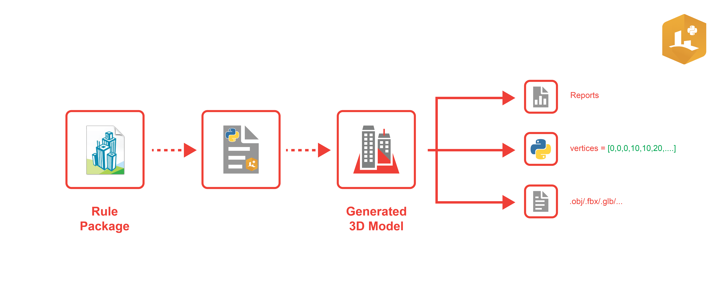

# PyPRT - Python Bindings for CityEngine SDK

PyPRT provides a Python binding for the [CityEngine Procedural RunTime (PRT)](https://github.com/esri/cityengine-sdk). This enables the execution of CityEngine CGA rules within Python. PyPRT allows to easily and efficiently generate 3D geometries, process them as Python data structures or export them to [multiple 3D file formats](https://esri.github.io/cityengine-sdk/html/esri_prt_codecs.html).



## Table of Contents

* [Installation](#installation)
* [Minimal Example](#minimal-example)
* [Documentation](#documentation)
* [Development](#development)
* [Licensing Information](#licensing-information)

## Installation

Run `pip install pyprt` in your (virtual) Python environment or `conda install -c esri pyprt` in a Conda environment. Then use `import pyprt` in your scripts.

We provide wheels and Conda packages for Python 3.9, 3.10, 3.11 and 3.12 on Linux and Windows. For other Python versions please [build](#development) PyPRT yourself.

## Minimal Example

```python
# see example.py in repository root

import os
import pyprt

# Define the input geometry
shape_geometry = pyprt.InitialShape([0, 0, 0, 0, 0, 100, 100, 0, 100, 100, 0, 0])

# Setup ModelGenerator instance for input geometry
model_generator = pyprt.ModelGenerator([shape_geometry])

# Setup generation parameters
repo_path = os.path.dirname(os.path.realpath(__file__))
rpk = os.path.join(repo_path, 'tests/data/extrusion_rule.rpk')
shape_attributes = {'shapeName': 'myShape', 'seed': 555}
encoder = 'com.esri.pyprt.PyEncoder'
encoder_options = {'emitReport': True, 'emitGeometry': True}

# Generate the model
generated_models = model_generator.generate_model([shape_attributes], rpk, encoder, encoder_options)

# Access the result
for model in generated_models:
    index = model.get_initial_shape_index()
    cga_report = model.get_report()
    vertices = model.get_vertices()
    print(f"Model {index} has vertices: {vertices} and reports {cga_report}")
```

## Documentation

* [PyPRT API Reference](https://esri.github.io/pyprt/apidoc/index.html)
* [PyPRT Examples](https://github.com/Esri/pyprt-examples)
* [PyPRT Changelog](CHANGELOG.md)
* [Authoring of Rule Packages in CityEngine](https://doc.arcgis.com/en/cityengine/latest/help/help-rule-package.htm#ESRI_SECTION1_F9D4CCCE0EC74E5FB646A8BD141A38F9)
* [CityEngine SDK (PRT) C++ API Reference](https://esri.github.io/cityengine-sdk/html/index.html)
* [Built-In PRT Encoders and Options](https://esri.github.io/cityengine-sdk/html/esri_prt_codecs.html)

## Development

### Project Overview

The project is composed of two parts: the C++ native directory (`src`) and Python-only directory (`pyprt`). The C++ part contains a standard CMake project with PyPRT native extension. The Python bindings are done using [pybind11](https://pybind11.readthedocs.io/en/stable/intro.html). The `pyprt` directory contains Python helper functions.

### Requirements

* C++ Compiler (C++ 17)
  * Windows: MSVC 14.37 (Visual Studio 2022) or later
  * Linux: GCC 11.2 or later (we build and test on RHEL8 compatible distros)
* Python (version >=3.9, <=3.12)
  * Packages required to build wheels and run PyPRT: build, setuptools, wheel, auditwheel, arcgis, shapely, twine, sphinx, numpy, pytest
* Optional: Conda (e.g. miniconda3)
* CMake (version >= 3.19)
* Ninja

A note regarding the meaning of "open a shell" in the following sections: this implies that the shell also needs to have the correct C++ compiler activated:

* On Windows, use the shortcuts provided by Visual Studio or run `vcvarsall.bat` of the desired MSVC toolchain.
* On RHEL-based Linux, run e.g. `source /opt/rh/gcc-toolset-11/enable`.

_Note: on Windows, replace `bin` with `Scripts` in the following commands. Some commands also differ in their file extension between Linux and Windows (`.sh` vs `.bat` and similar). Please refer to the `venv` documentation for details: <https://docs.python.org/3.8/library/venv.html>_

### Build Python Wheel

1. Open a shell in the PyPRT git root.
1. First time only: set up a virtual Python environment with build dependencies for PyPRT. Adapt `python3.12` and the `envs` file to your desired OS/Python combination.
    1. Create the virtual environment: `python3.12 -m venv .venv`
    1. Get latest pip: `.venv/bin/python -m pip install --upgrade pip`
    1. Get latest wheel: `.venv/bin/python -m pip install --upgrade wheel`
    1. Install build dependencies for PyPRT: `.venv/bin/python -m pip install -r envs/linux/wheel/requirements-py3.12.txt`
1. Run `.venv/bin/python -m build --wheel`. This will build the CMake project and Python package. See [below](#c-debug-builds) for native debug mode.
1. The resulting wheel is written to the temporary `dist` folder.

Note: To build a wheel with the native extension module in debug mode, edit the `debug` argument to `CMakeExtension` at the bottom of `setup.py`. Also see "Iterative C++ Development" below.

### Build Conda Package

1. Install Miniconda or Anaconda.
1. Open a shell in the PyPRT git root and activate Miniconda (or Anaconda).
1. First time only: run `conda env create -n pyprt --file envs/linux/conda/environment-py3.12.yml` to create a conda environment with all the required Python packages (adapt to your desired OS/Python combination).
1. First time only: run `conda install -n pyprt -c esri arcgis` (this is a workaround to reduce conda env resolving time in the step above)
1. Activate the new conda env: `conda activate pyprt`
1. Run `conda build ./conda-recipe`. This will build the CMake project and Python packages. See [below](#c-debug-builds) for native debug mode.
1. The resulting package is written to the `<miniconda home>/envs/pyprt/conda-bld/{platform}` directory.

### Iterative Python Development

1. Open a shell in the PyPRT git root.
1. First time only: setup a virtual Python environment with build dependencies for PyPRT, see "Build Python Wheel" [above](#build-python-wheel).
1. Run `source .venv/bin/activate` (on Windows, run `.venv\Scripts\activate.bat`) to activate the required Python packages.
1. Install PyPRT in current pip environment in dev mode by running `python -m pip install --force-reinstall -e .` (note the dot at the end). This will use CMake to build the native extension module and copy it into the python source directory.
1. Now you can iterate on the Python part of PyPRT...
1. To leave development mode, run `pip uninstall pyprt`
1. Run `deactivate` to leave the venv shell.

### Iterative C++ Development

The `src/cpp` directory contains a standard CMake project with the PyPRT native extension module.

1. Follow the steps as in the section "iterative Python development" above.
1. We need to tell CMake to install the native extension module into the "live" editable PyPRT package: `cmake -G Ninja -DCMAKE_BUILD_TYPE=Release -DCMAKE_INSTALL_PREFIX=./src/python/pyprt/pyprt -DPython_EXECUTABLE:FILEPATH=./.venv/bin/python -S src/cpp -B build/cpp-release-build`
1. Optional: To debug the native extension module, switch CMake to `RelWithDebInfo` mode: `-DCMAKE_BUILD_TYPE=RelWithDebInfo`. This will _disable optimization_ (`-O0`) to provide correct per-line debugging.
1. Build with `cmake --build build/cpp-release-build --target install`

### Running Unit Tests

Quick way to build and run all tests in a separate virtual environment:

1. Open a shell in the PyPRT git root.
1. Run helper script: `python build_and_run_tests.py`

Detailed steps to run tests for development (basically what the `build_and_run_tests.py` script does):

1. Open a shell in the PyPRT git root.
1. First time only: setup a virtual Python environment with build dependencies for PyPRT, see "Build Python Wheel" [above](#build-python-wheel).
1. Build and install PyPRT with test dependencies into local env: `.venv/bin/python -m pip install .[test]`
1. Run the tests: `.venv/bin/pytest tests`
1. Uninstall PyPRT from local env: `.venv/bin/python -m pip uninstall pyprt`
1. Cleanup intermediate build files: `.venv/bin/python setup.py clean --all`

### Build the API documentation

1. Install PyPRT in development mode as described [above](#iterative-python-development).
1. Run `.venv/bin/sphinx-build docs build/sphinx`, this will output the html files into the `build/sphinx` directory.
1. Leave development mode also as described [above](#iterative-python-development).

### Build with Docker

Note: On Windows, Docker needs to be switched to "Windows Containers".

#### Build Wheels

1. Open a shell in the PyPRT git root
1. Create the base image for the desired build toolchain (adapt to your desired Python version):
   * Linux: `docker build --rm -f envs/linux/base/Dockerfile -t pyprt-base:linux .`
   * Windows: `docker build --rm -f envs\windows\base\Dockerfile -t pyprt-base:windows-py3.12 --build-arg BASE_IMAGE=python:3.12-windowsservercore-1809 .`
1. Create the desired image for the build toolchain (adapt to your desired Python version):
   * Linux: `docker build --rm -f envs/linux/wheel/Dockerfile -t pyprt:linux-py3.12 --build-arg PY_VER=3.12 .`
   * Windows: `docker build --rm -f envs\windows\wheel\Dockerfile -t pyprt:windows-py3.12 --build-arg PY_VER=3.12 .`
1. Run the build
   * Linux: `docker run --rm -e DEFAULT_UID=$(id -u) -e DEFAULT_GID=$(id -g) -v $(pwd):/tmp/pyprt/root -w /tmp/pyprt/root pyprt:linux-py3.12 bash -c 'python -m build --wheel'`
   * Windows: `docker run --rm -v %cd%:C:\temp\pyprt\root -w C:\temp\pyprt\root pyprt:windows-py3.12 cmd /c "python -m build --wheel"`
1. The resulting wheel should appear in the `dist` directory.

#### Build Conda Packages

1. Open a shell in the PyPRT git root
1. Create the base image for the desired build toolchain:
    * Linux: `docker build --rm -f envs/linux/base/Dockerfile -t pyprt-base:linux .`
    * Windows: `docker build --rm -f envs\windows\base\Dockerfile -t pyprt-base:windows .`
1. Create the desired image for the build toolchain (adapt `py3.12` to your desired Python version):
    * Linux: `docker build --rm -f envs/linux/conda/Dockerfile -t pyprt:linux-py3.12-conda --build-arg PY_VER=3.12 .`
    * Windows: `docker build --rm -f envs\windows\conda\Dockerfile -t pyprt:windows-py3.12-conda --build-arg PY_VER=3.12 .`
1. Run the build
    * Linux: `docker run --rm -e DEFAULT_UID=$(id -u) -e DEFAULT_GID=$(id -g) -v $(pwd):/tmp/pyprt/root -w /tmp/pyprt/root pyprt:linux-py3.12-conda bash -c 'conda build ./conda-recipe && cp -r /tmp/pyprt/pyprt-conda-env/conda-bld/linux-64/pyprt*.tar.bz2 /tmp/pyprt/root'`
    * Windows: `docker run --rm -v %cd%:C:\temp\pyprt\root -w C:\temp\pyprt\root pyprt:windows-py3.12-conda cmd /c "conda build ./conda-recipe && copy C:\temp\conda\envs\pyprt\conda-bld\win-64\pyprt-*.tar.bz2 C:\temp\pyprt\root"`
1. The resulting conda package will be located in the current directly (PyPRT git repo root).

## Licensing Information

PyPRT is free for personal, educational, and non-commercial use. Commercial use requires at least one commercial license of the latest CityEngine version installed in the organization. Redistribution or web service offerings are not allowed unless expressly permitted.

PyPRT is under the same license as the included [CityEngine SDK](https://github.com/esri/cityengine-sdk#licensing). An exception is the PyPRT source code (without CityEngine SDK, binaries, or object code), which is licensed under the Apache License, Version 2.0 (the “License”); you may not use this work except in compliance with the License. You may obtain a copy of the License at https://www.apache.org/licenses/LICENSE-2.0

All content in the "Examples" directory/section is licensed under the APACHE 2.0 license as well.

For questions or enquiries, please contact the Esri CityEngine team (cityengine-info@esri.com).

[Back to top](#table-of-contents)
