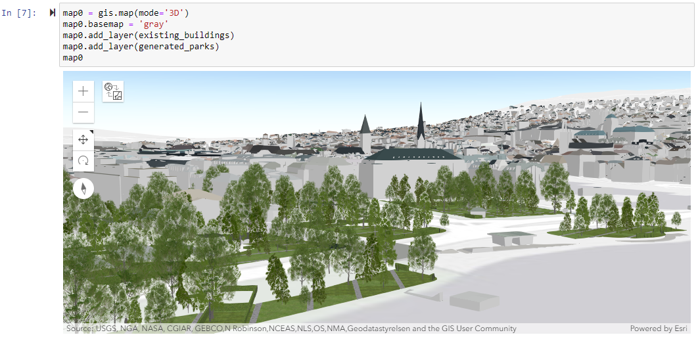

# PyPRT - Python Bindings for CityEngine SDK

PyPRT is a Python binding for PRT (CityEngine Procedural Runtime). It enables the execution of CityEngine CGA rules within Python. PyPRT allows to easily and efficiently generate 3D geometries.

This repo contains examples of PyPRT usage. You can find the source code in the main [pyprt](https://github.com/Esri/pyprt) repository. More detailed information is available there.

 

## Table of Contents

* [Installation](#installation)
* [Examples](#examples)
* [Usage](#usage)
* [License](#license)

## Installation

Simply run `pip install pyprt` in your desired Python environment or `conda install pyprt` in a Conda environment. Then use `import pyprt` in your scripts.

## Examples

<table style="width:100%">
  <tr>
    <th>Name</th>
    <th>Feature</th> 
    <th>Notes</th>
  </tr>
  <tr>
    <td>ex1_python_encoder.py</td>
    <td>This example shows the use of the Python encoder and the encoder options for generating (or not) geometries and CGA reports. </td>
    <td> </td>
  </tr>
  <tr>
    <td>ex2_obj_initial_shape.py</td>
    <td>This example demonstrates the use of an OBJ file as initial shape.</td>
    <td> </td>
  </tr>
  <tr>
    <td>ex3_format_exporter.py</td>
    <td>In this example, the generated models are exported as OBJ files using the PRT OBJ exporter.</td>
    <td> </td>
  </tr>
  <tr>
    <th>ex4_multi_generations.py</th>
    <th>This example shows the two ways of calling the generate_model function in case of multiple successive geometry generations.</th> 
    <th> </th>
  </tr>
  <tr>
    <td>ex5_dataset_collection.ipynb</td>
    <td>This example demonstrates how PyPRT can be used to collect a dataset stored as pandas dataframe, using the PyEncoder options.</td>
    <td> </td>
  </tr>
  <tr>
    <td>ex6_3d_visualization_vispy.py</td>
    <td>In this examples, VisPy is used as a mesh visualization tool taking PyPRT generated model (vertices and faces) as input.</td>
    <td> </td>
  </tr>
  <tr>
    <td>ex7_building_modeling_optimization.ipynb</td>
    <td>This example is about optimizing the attributes of a building generated on a parcel considering the green area of the building. SciPy is used as the optimization library.</td>
    <td>PyGEL3D is used as a visualization tool in this example. Linux users will have to use another library.</td>
  </tr>
  <tr>
    <td>ex8_3d_gis_content_generation.ipynb</td>
    <td>This example demonstrates how PyPRT can be used with the ArcGIS API for Python in order to collect data from ArcGIS Online, generate 3D content and publish the content back to ArcGIS Online.</td>
    <td>In order to publish and visualize the generated trees, the user needs an ArcGIS Online account. If this is the case, the user will have to check that the published item has a non existing name.</td>
  </tr>
</table>

## Usage

In the Python environment where PyPRT is installed, run `python examples\ex1_python_encoder.py` to execute the corresponding Python script.
Concerning the Jupyter Notebooks, first run `jupyter notebook` and open the desired example notebook. 

## License

PyPRT is under the same license as the included [CityEngine SDK](https://github.com/Esri/esri-cityengine-sdk#licensing).

An exception is the PyPRT source code (without CityEngine SDK, binaries, or object code), which is licensed under the Apache License, Version 2.0 (the “License”); you may not use this work except in compliance with the License. You may obtain a copy of the License at http://www.apache.org/licenses/LICENSE-2.0.

[Back to top](#table-of-contents)
[Go to source code](https://github.com/Esri/pyprt)