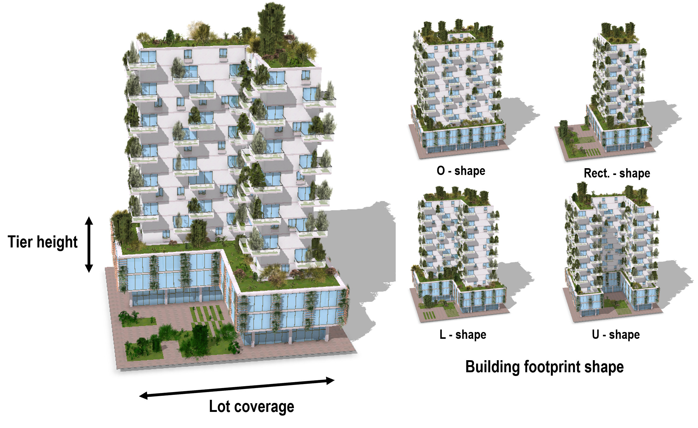
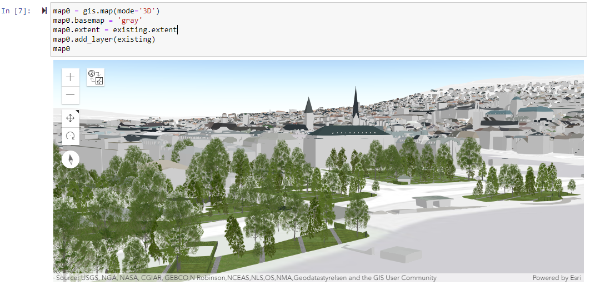

<table>
<tr>
	<td style="font-size:22pt;text-align:center;vertical-align:bottom"><a href="#downloads"> Downloads</a></td>
	<td style="font-size:22pt;text-align:center;vertical-align:bottom"><a href="#examples"> Examples</a></td>
	<td style="font-size:22pt;text-align:center;vertical-align:bottom"><a href="https://github.com/Esri/pyprt/blob/master/README.md#documentation"> Documentation</a></td>
</tr>
</table>

PyPRT is a Python binding for PRT (“Procedural Runtime”). It enables the execution of [CityEngine](http://www.esri.com/software/cityengine) CGA rules within Python. Using PyPRT, the generation of 3D content in Python is greatly simplified. Therefore, Python developers, data scientists, GIS analysts, etc. can efficiently make use of CityEngine rule packages in order to create 3D geometries stored as Python data structures, or to export these geometries in another format (like OBJ, Scene Layer Package, … ). Given an initial geometry, on which to apply the CGA rule, the 3D generation is procedurally done in Python (Python script, Jupyter Notebook, …). This allows for efficient and customizable geometry generation. For instance, when modeling buildings, PyPRT users can easily change the parameters of the generated buildings (like the height or the shape) by changing the values of the CGA rule input attributes.

PyPRT 3D content generation is based on CGA rule packages (RPK), which are authored in CityEngine. RPKs contain the CGA rule files that define the shape transformations, as well as supplementary assets. RPK examples can be found below and directly used in PyPRT.

PyPRT allows generating 3D models on multiple initial geometries. Different input attributes can be applied on each of these initial shapes. Moreover, the outputted 3D geometries can either be used inside Python or exported to another format by using one of PRT encoders.

*PyPRT is free for non-commercial use.* Commercial use requires at least one commercial license of the latest CityEngine version installed in the organization. No redistribution is allowed. Please refer to the licensing section below for more detailed licensing information.

## Downloads

|    | PyPRT 1.0, PRT 2.0 |
|  | PyPRT 1.0, PRT 2.0 |

## Examples

<table>

<tr><td colspan="2"><h3>3D Model Optimization</h3></td></tr>
<tr>
	<td width="420px">
		
	</td>
	<td>
		
In this example, we want to answer the following question:
		given the architectural design of a building (defined by the CGA rule) and the parcel, which value of the building parameters should we choose in order to maximize the building green potential?
		The Jupyter Notebook goes through different steps:
		<ol>
			<li>Specify the desired CGA rule package and parcel to build on.</li>
			<li>Greenery optimization: optimize the total green area reported by taking into account the shape of the building, the lot coverage and the height of the building first tier.</li>
			<li>Multi-objectives optimization: optimize the total green area and the floor area in a O-shape building, by taking into account the lot coverage and the height of the building first tier.</li>
			<li>Visualize the results.</li>
		</ol>
		Link to the example notebook.
		

	</td>
</tr>

<tr><td colspan="2"><h3>3D GIS Content Creation</h3></td></tr>
<tr>
	<td>
		
	</td>
	<td>
		
This example presents a possible worklow consisting of collecting and selecting city parcels, and populating them with procedurally generated trees. To do so, PyPRT is used in combination with other Python libraries, e.g. the ArcGIS API for Python.
		The Jupyter Notebook goes through different steps:
		<ol>
			<li>Get buildings parcels from ArcGIS Online and show them on a map.</li>
			<li>Select parcels to redevelop.</li>
			<li>PRT generation using the GreenspaceConstruction CGA rule package and export as a Scene Layer Package (SLPK).</li>
			<li>Upload and publish the generated SLPK on ArcGIS Online.</li>
			<li>Visualize the results.</li>
		</ol>
		Link to the example notebook.
		

	</td>
</tr>

<tr><td colspan="2"><h3>Other Examples</h3></td></tr>
<tr>
	<td>
	</td>
	<td>
		
Other examples of PyPRT usage are located in the <a href="https://github.com/Esri/pyprt-examples">pyprt-examples</a>Github repo. Ready-to-use rule packages and initial shapes are available there.
	

	</td>
</tr>

</table>

## Licensing

PyPRT is under the same license as the included [CityEngine SDK](https://github.com/Esri/esri-cityengine-sdk#licensing).

An exception is the PyPRT source code (without CityEngine SDK, binaries or object code), which is licensed under the Apache License, Version 2.0 (the “License”); you may not use this work except in compliance with the License. You may obtain a copy of the License at [http://www.apache.org/licenses/LICENSE-2.0](http://www.apache.org/licenses/LICENSE-2.0).